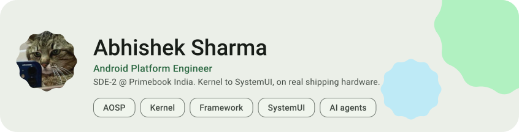
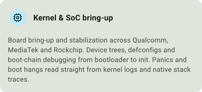
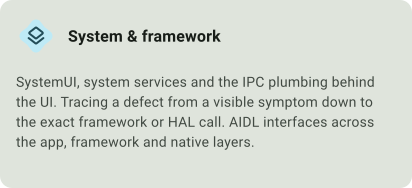
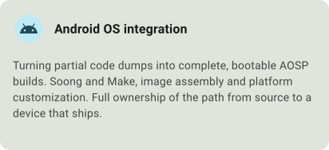
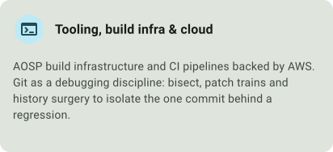
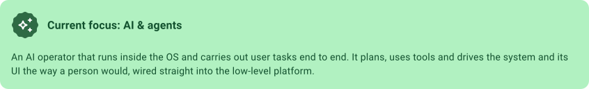
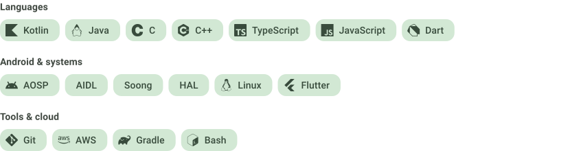

<picture>
  <source media="(max-width: 620px) and (prefers-color-scheme: dark)" srcset="assets/hero-dark-compact.svg">
  <source media="(max-width: 620px)" srcset="assets/hero-light-compact.svg">
  <source media="(prefers-color-scheme: dark)" srcset="assets/hero-dark.svg">
  
</picture>

### <picture><source media="(max-width: 620px) and (prefers-color-scheme: dark)" srcset="assets/section-about-dark-compact.svg"><source media="(max-width: 620px)" srcset="assets/section-about-light-compact.svg"><source media="(prefers-color-scheme: dark)" srcset="assets/section-about-dark.svg"></picture>

**Android platform engineer, SDE-2 at Primebook India.** I take Android from a raw SoC and a
barely booting code dump to a stable OS running on real, shipping hardware.

Since 2019 I've lived in the parts of the stack most people never touch: **SystemUI, framework
services, HALs and the kernel**. Lately I'm also building an **AI operator that runs inside the OS**
and gets your tasks done for you.

<picture>
  <source media="(prefers-color-scheme: dark)" srcset="assets/achievement-dark.svg">
  
</picture>

### <picture><source media="(max-width: 620px) and (prefers-color-scheme: dark)" srcset="assets/section-expertise-dark-compact.svg"><source media="(max-width: 620px)" srcset="assets/section-expertise-light-compact.svg"><source media="(prefers-color-scheme: dark)" srcset="assets/section-expertise-dark.svg"></picture>

<picture><source media="(prefers-color-scheme: dark)" srcset="assets/card-kernel-dark.svg"></picture>
<picture><source media="(prefers-color-scheme: dark)" srcset="assets/card-framework-dark.svg"></picture>
<picture><source media="(prefers-color-scheme: dark)" srcset="assets/card-aosp-dark.svg"></picture>
<picture><source media="(prefers-color-scheme: dark)" srcset="assets/card-infra-dark.svg"></picture>

<picture>
  <source media="(max-width: 620px) and (prefers-color-scheme: dark)" srcset="assets/card-agents-dark-compact.svg">
  <source media="(max-width: 620px)" srcset="assets/card-agents-light-compact.svg">
  <source media="(prefers-color-scheme: dark)" srcset="assets/card-agents-dark.svg">
  
</picture>

### <picture><source media="(max-width: 620px) and (prefers-color-scheme: dark)" srcset="assets/section-stack-dark-compact.svg"><source media="(max-width: 620px)" srcset="assets/section-stack-light-compact.svg"><source media="(prefers-color-scheme: dark)" srcset="assets/section-stack-dark.svg"></picture>

<picture>
  <source media="(max-width: 620px) and (prefers-color-scheme: dark)" srcset="assets/stack-dark-compact.svg">
  <source media="(max-width: 620px)" srcset="assets/stack-light-compact.svg">
  <source media="(prefers-color-scheme: dark)" srcset="assets/stack-dark.svg">
  
</picture>

### <picture><source media="(max-width: 620px) and (prefers-color-scheme: dark)" srcset="assets/section-activity-dark-compact.svg"><source media="(max-width: 620px)" srcset="assets/section-activity-light-compact.svg"><source media="(prefers-color-scheme: dark)" srcset="assets/section-activity-dark.svg"></picture>

<picture>
  <source media="(prefers-color-scheme: dark)" srcset="https://streak-stats.demolab.com/?user=abhixv&border_radius=12&background=1C211C&border=414942&stroke=414942&ring=96D5A6&fire=96D5A6&currStreakNum=DFE4DC&sideNums=DFE4DC&currStreakLabel=96D5A6&sideLabels=C1C9BF&dates=8B938A">
  
</picture>

### <picture><source media="(max-width: 620px) and (prefers-color-scheme: dark)" srcset="assets/section-connect-dark-compact.svg"><source media="(max-width: 620px)" srcset="assets/section-connect-light-compact.svg"><source media="(prefers-color-scheme: dark)" srcset="assets/section-connect-dark.svg"></picture>

<a href="https://github.com/abhixv"><picture><source media="(prefers-color-scheme: dark)" srcset="assets/btn-github-dark.svg"></picture></a>
<a href="https://www.linkedin.com/in/abhixv"><picture><source media="(prefers-color-scheme: dark)" srcset="assets/btn-linkedin-dark.svg"></picture></a>
<a href="mailto:abhixv.sh@gmail.com"><picture><source media="(prefers-color-scheme: dark)" srcset="assets/btn-email-dark.svg"></picture></a>

Open to conversations about Android platform work, AOSP and low-level systems.

